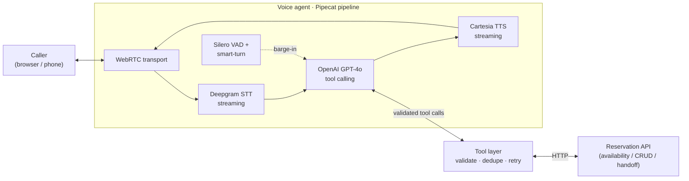

<div align="center">

# 🎙️ Luma — Real-Time Voice AI Reservation Agent

**An AI phone host that answers every reservation call in real time — booking, modifying, and cancelling tables through natural conversation, so restaurants stop losing revenue to the calls they can't pick up.**

Streaming speech-to-text → LLM tool-calling → streaming text-to-speech, with natural turn-taking, barge-in, bounded failure-recovery, and guaranteed duplicate-write prevention.

[](https://github.com/Akarshg29/Realtime-voice-reservation-agent/actions/workflows/ci.yml)
[](https://www.python.org/)
[](https://github.com/pipecat-ai/pipecat)
[](LICENSE)
[](tests/)

</div>

---

## 📉 The problem: the phone keeps ringing — and no one can answer it

Restaurants run on thin margins and full hands. When the phone rings during a dinner rush, the staff are already serving the room — so the call goes to voicemail, or nowhere. That silent gap is one of hospitality's largest, least-visible revenue leaks:

| Reality | Figure | Source |
|---|---|---|
| U.S. restaurant revenue lost each year to **unanswered phone calls** | **≈ $20 billion / year** | [QSR Magazine](https://www.qsrmagazine.com/story/while-the-phone-rings-restaurants-are-losing-20-billion/) |
| Share of calls that go **unanswered during peak hours** (peak call time = peak service time) | **≈ 30–60%** | [industry analyses](https://www.qsrmagazine.com/story/while-the-phone-rings-restaurants-are-losing-20-billion/) |
| Diners who **still book by phone** (it's the channel Americans most associate with reaching a restaurant) | **≈ 37%** | [Tableo](https://tableo.com/food-beverage-trends/restaurant-reservation-statistics-2025-trends/) |
| Callers who **never call back** after one missed attempt | **≈ 85%** *(industry estimate)* | [industry data](https://www.getaira.io/blog/missed-business-calls-statistics) |
| Global revenue lost to **no-shows** (typical no-show rate 10–20%) | **≈ $16 billion / year** | [industry reports](https://restaurant.eatapp.co/blog/restaurant-no-shows) |

> 💸 **The bottom line:** every missed call is worth an estimated **$35–$85** in walk-away revenue, and by some industry estimates a single busy location can leave up to **~$290K/year** on the table from missed calls alone. High intent, zero capture.

### ⏱️ Why now
The technology to actually fix this only recently became fast and cheap enough for live phone conversations. Streaming speech models now hit sub-second response, and the market has noticed:

- **Conversational-AI market → ≈ $41.4B by 2030**, growing **~24% CAGR** — [Grand View Research](https://www.grandviewresearch.com/industry-analysis/conversational-ai-market-report)
- **Voice-specific AI agents** growing even faster at **~35% CAGR** — [Market.us](https://market.us/report/voice-ai-agents-market/)

The opportunity is clear; the hard part is building something **reliable** enough to trust with real bookings. That's what this project is about.

---

## ✅ What Luma does about it

Luma is an AI voice host that picks up instantly and handles the whole reservation conversation — so no high-intent call is ever lost, and every booking is accurate.

| The gap | How Luma closes it |
|---|---|
| Calls missed at peak → lost bookings | **Answers every call instantly**, in parallel, around the clock — no hold music, no voicemail |
| Rushed staff → wrong times, double-bookings | **Validated tool-calls + deterministic idempotency** — it never double-books and never invents availability |
| Unconfirmed bookings → no-shows | **Explicit spoken confirmation** of every booking (automated reminders on the roadmap) |
| After-hours & overflow demand | Runs 24/7 at **~$0.10–0.25 per 5-minute call** — a fraction of staffed answering |
| Edge cases a bot shouldn't force | **Graceful human handoff** that preserves the full conversation + collected details |

> Design philosophy: **reliability over surface area.** The entire business core (tool-calling, validation, retries, idempotency) is framework-agnostic Python, unit-tested against a real API **with no cloud keys**. The voice pipeline is a thin, swappable shell around it.

---

## 🗣️ Three conversational workflows

1. **Check availability & book** — collects name, phone, date, time, party size, and notes; checks live availability; if the slot is full it offers the **real** alternatives the backend returns (never invented); reads the details back for explicit confirmation; then creates exactly one reservation and reads back the confirmation code.
2. **Modify or cancel** — finds a booking by confirmation code or phone, reads it back, confirms the change, and patches or cancels it.
3. **Handle the messy middle** — barge-in/correction mid-sentence, retry-once on transient failures, invalid-input re-prompts, duplicate-call protection, silence handling, and human handoff with full context preserved.

---

## 🏗️ Architecture



The LLM never touches the network directly. Every side effect goes through the **tool layer**, which validates arguments, applies deterministic idempotency, retries transient failures, and returns compact, model-actionable results. The same tool layer is exercised by the tests and the eval harness — the voice shell adds no business logic.

## 🧰 Tech stack

| Concern | Choice | Why |
|---|---|---|
| Orchestration | **[Pipecat](https://github.com/pipecat-ai/pipecat) 1.6** | Real-time frame pipeline, VAD turn-taking, native barge-in, metrics, swappable services |
| Speech-to-Text | **Deepgram** (`nova-2`, streaming) | Low latency + word-error-rate on conversational English |
| LLM | **OpenAI GPT-4o** *or* **Groq** (free) | Reliable function calling; swap via `LLM_PROVIDER` in `.env` — default `.env.example` uses Groq (free, low-latency) |
| Text-to-Speech | **Cartesia** (Sonic, streaming) | Lowest time-to-first-audio → best perceived latency |
| Transport | **Self-hosted WebRTC** (SmallWebRTC) | Browser-native, no extra accounts; ships a prebuilt UI |
| Backend | **FastAPI** reservation service | Availability, reservations CRUD, idempotent writes, handoff |

Everything is provider-swappable via `.env` — swap Cartesia for ElevenLabs, GPT-4o for a local model, etc.

## 🔬 Engineering highlights

- ⚡ **Low latency by construction** — every stage streams; end-of-speech→first-audio is measured and logged per turn (target p95 < 1.5 s).
- 🗣️ **Natural turn-taking + barge-in** — Silero VAD + a smart-turn analyzer let callers interrupt and correct mid-sentence; in-flight generation is cancelled instantly.
- 🔒 **Duplicate-proof writes** — deterministic idempotency keys + a per-call cache make every create safe to retry and impossible to double-book.
- ♻️ **Bounded failure recovery** — transient (HTTP 503 / network) errors retry once with backoff; persistent failures escalate to a human handoff that preserves context.
- 🧪 **Real testing + evaluation** — 20 automated tests and a scenario eval harness emitting task-success, tool-call accuracy, duplicate-write rate, and latency percentiles.
- 🔭 **Observability** — structured JSON logs with PII masking, per-service TTFB, and reservation-API latency.

## 📊 Results

Latest evaluation run ([`EVALUATION_RESULTS.md`](EVALUATION_RESULTS.md)):

| Metric | Result |
|---|---|
| Task success rate | **7/7 (100%)** |
| Tool-call accuracy | **16/16** |
| Duplicate-write rate | **0/7** |
| Reservation-API latency | **p50 0.7 ms · p95 2.0 ms** |

Scenarios covered: booking an available slot, offering real alternatives for a full slot, mid-call corrections, modify, cancel, transient-failure recovery, and duplicate-write protection.

## 📁 Repository layout

```
.
├── src/luma_agent/
│   ├── config.py            # env-driven settings; provider-swappable
│   ├── api_client.py        # async HTTP client: bounded retry, idempotent writes, error normalisation
│   ├── tools.py             # validation, normalisation, dedupe, tool schemas + dispatch  <- core
│   ├── prompts.py           # system prompt (3 workflows, confirmation discipline)
│   ├── logging_utils.py     # structured JSON logging with PII masking
│   ├── metrics.py           # latency recorder (p50/p95)
│   └── bot.py               # Pipecat pipeline (STT->LLM->TTS), barge-in, metrics; serves the WebRTC UI
├── mock_api/                # mock reservation API (FastAPI) the agent books against
├── data/                    # restaurant seed data + test scenarios
├── client/                  # optional custom browser client (a prebuilt UI ships by default)
├── tests/                   # pytest: API client + end-to-end scenarios (no keys needed)
├── eval/run_eval.py         # scenario eval harness -> EVALUATION_RESULTS.md
├── docs/DESIGN.md           # architecture deep-dive (state, retries, scaling, security, cost)
├── EVALUATION_RESULTS.md    # latest evaluation run
├── docker-compose.yml       # reservation API
└── pyproject.toml
```

## 🚀 Quickstart

**Prerequisites:** Python 3.11+ · API keys for the live demo (OpenAI, Deepgram, Cartesia — *tests & eval need none*) · Docker (optional).

```bash
git clone https://github.com/Akarshg29/Realtime-voice-reservation-agent.git
cd Realtime-voice-reservation-agent
python3 -m venv .venv && source .venv/bin/activate
pip install -e ".[dev]"          # or: make install
cp .env.example .env              # paste in your keys
```

```bash
# 1) reservation API  (Docker, or `make api-local` for native)
docker compose up --build         # -> http://localhost:8000  (Swagger at /docs)

# 2) voice agent
python -m luma_agent.bot          # -> open http://localhost:7860, click Connect, talk
```

## 🎧 Talking to it

Open **http://localhost:7860**, click **Connect**, allow the microphone, and speak naturally:

- *"I'd like a table for four on Friday at 6 PM."*
- *"6:30 is taken? Then let's do 7:30."*  → it offers real alternatives
- *"Actually, make that six people."*  → interrupt mid-sentence; it adapts
- *"I need to change my reservation, the code is LUMA-4821."*
- *"Can you cancel my booking?"*

## 🧪 Testing & evaluation

```bash
make test                                  # 20 tests, no keys, ~2s
python eval/run_eval.py --mode scripted    # deterministic eval -> EVALUATION_RESULTS.md
python eval/run_eval.py --mode llm         # full GPT-4o-driven eval (needs OPENAI_API_KEY)
```

## 🛠️ Reliability & failure handling

| Situation | Behaviour |
|---|---|
| Caller interrupts / corrects | VAD → interruption cancels the in-flight LLM turn and flushes TTS; agent re-plans on the latest value |
| Transient backend failure (503 / network) | Retried **once** with backoff; returns the real result, never invented |
| Persistent failure | Escalates to a human handoff with a full context summary |
| Invalid tool arguments | Normalised/validated in the tool layer; a structured error makes the agent re-ask for exactly what's missing |
| Repeated / duplicate create | Deterministic idempotency key + per-call cache → one write, identical response |
| Party too large / can't complete | `transfer_to_human` with an enriched summary (name/phone/date/time/party preserved) |
| Silence / misheard | Agent asks the caller to repeat; never guesses critical details |

## 📐 Design deep-dive

Full engineering rationale — session/state model, barge-in mechanics, argument validation, duplicate prevention, retry policy, handoff, production metrics, a 10→100→1,000 concurrent-call scaling plan, PII/secrets handling, and a per-call cost estimate — lives in **[`docs/DESIGN.md`](docs/DESIGN.md)**.

## 🗺️ Roadmap

- [ ] Telephony transport (Twilio / Telnyx) for a real inbound phone number
- [ ] Automated SMS/email confirmations + reminders to cut no-shows
- [ ] Persist session state to Redis for multi-worker recovery
- [ ] Multilingual STT/TTS
- [ ] Post-call transcript + structured summary to a CRM
- [ ] Prompt-cached system prompt to cut per-call LLM cost

## 📚 Sources

- QSR Magazine — *While the Phone Rings, Restaurants are Losing $20 Billion* — https://www.qsrmagazine.com/story/while-the-phone-rings-restaurants-are-losing-20-billion/
- Grand View Research — *Conversational AI Market Report* — https://www.grandviewresearch.com/industry-analysis/conversational-ai-market-report
- Market.us — *Voice AI Agents Market* — https://market.us/report/voice-ai-agents-market/
- Tableo — *Restaurant Reservation Statistics* — https://tableo.com/food-beverage-trends/restaurant-reservation-statistics-2025-trends/
- Eat App — *Restaurant No-Shows* — https://restaurant.eatapp.co/blog/restaurant-no-shows

*Figures are industry estimates from the sources above and are directional; they frame the problem's scale rather than a specific venue's numbers.*

## 📄 License

[MIT](LICENSE) © Akarsh Gupta
